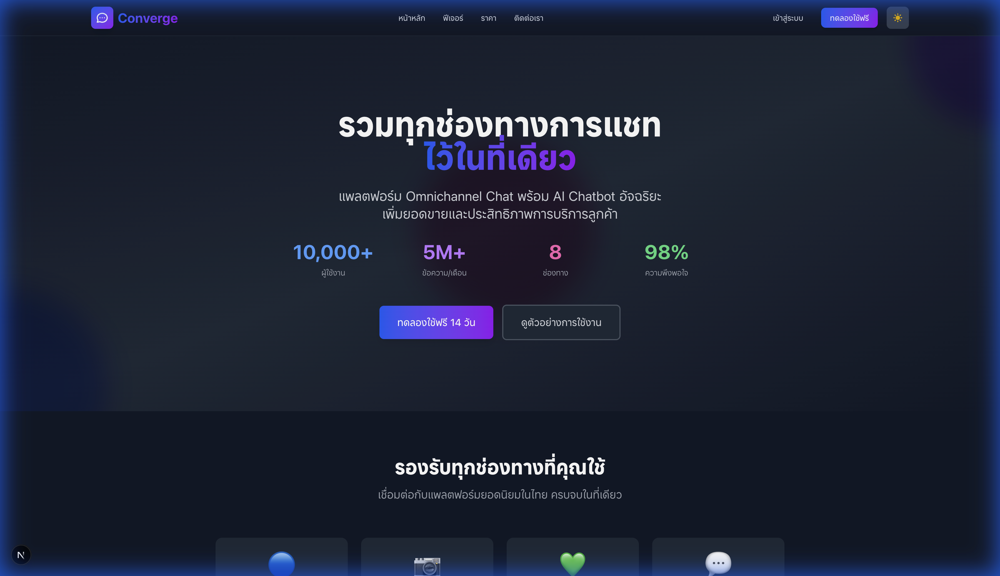
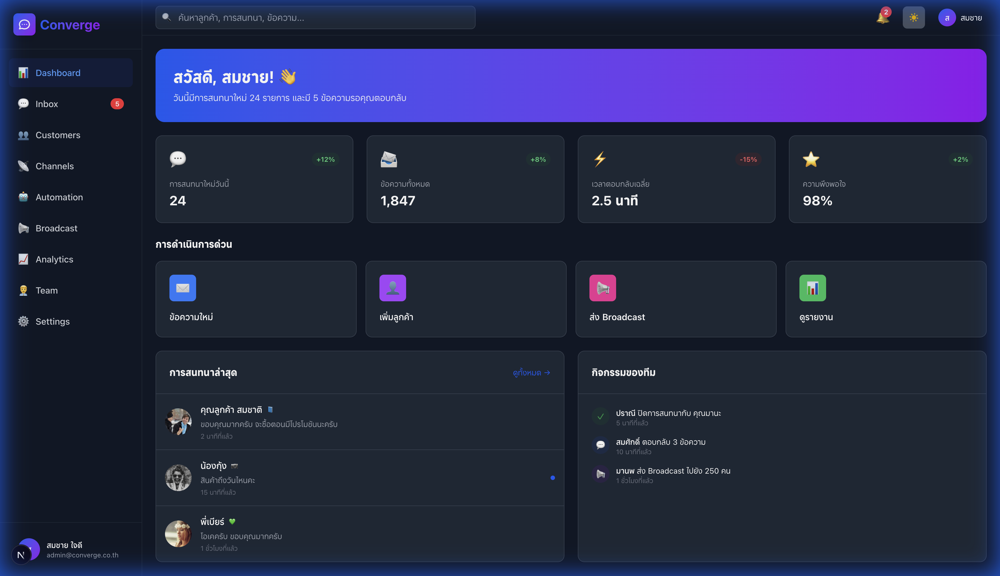

<div align="center">
  
  
  # Converge
  
  ### 🚀 Omnichannel Chat Platform with AI Chatbot for Business
  
  **รวมทุกช่องทางการแชทในที่เดียว พร้อม AI ตอบอัตโนมัติ 24/7**

  [](https://nextjs.org/)
  [](https://react.dev/)
  [](https://www.typescriptlang.org/)
  [](https://tailwindcss.com/)
  [](https://supabase.com/)
  
  [](https://github.com/danya0365/converge-nextjs/stargazers)
  [](https://github.com/danya0365/converge-nextjs/network/members)
  [](https://github.com/danya0365/converge-nextjs/issues)
  [](LICENSE)

  [🌐 Live Demo](https://converge.vercel.app) · [📖 Documentation](#-documentation) · [🐛 Report Bug](https://github.com/danya0365/converge-nextjs/issues) · [✨ Request Feature](https://github.com/danya0365/converge-nextjs/issues)

</div>

---

## 📸 Screenshots

<div align="center">
  
  <p><em>Landing Page - Modern & Professional Design</em></p>
  
  <br/>
  
  
  <p><em>Dashboard - Real-time Analytics & Metrics</em></p>
</div>

---

## ✨ Features

<table>
  <tr>
    <td align="center" width="33%">
      <br>
      <b>Unified Inbox</b><br>
      รวมแชทจากทุกช่องทางในหน้าจอเดียว
    </td>
    <td align="center" width="33%">
      <br>
      <b>AI Chatbot</b><br>
      ตอบอัตโนมัติ 24/7 ด้วย AI อัจฉริยะ
    </td>
    <td align="center" width="33%">
      <br>
      <b>Analytics</b><br>
      วิเคราะห์ข้อมูลลูกค้าเชิงลึก
    </td>
  </tr>
  <tr>
    <td align="center" width="33%">
      <br>
      <b>Broadcast</b><br>
      ส่งข้อความถึงลูกค้าหลายพันคน
    </td>
    <td align="center" width="33%">
      <br>
      <b>Team Collaboration</b><br>
      ทำงานร่วมกันเป็นทีม
    </td>
    <td align="center" width="33%">
      <br>
      <b>Automation</b><br>
      สร้าง Flow อัตโนมัติ
    </td>
  </tr>
</table>

### 🔗 Supported Channels

<p align="center">
  
  
  
  
  
  
  
</p>

---

## 🛠️ Tech Stack

| Category | Technologies |
|----------|-------------|
| **Framework** | Next.js 15.5 (App Router, Turbopack) |
| **Frontend** | React 19, TypeScript 5 |
| **Styling** | Tailwind CSS 4, CSS Variables |
| **State Management** | Zustand 5 |
| **Database** | Supabase (PostgreSQL) |
| **Forms** | React Hook Form + Zod |
| **Icons** | Lucide React |
| **Theme** | next-themes (Dark/Light mode) |

---

## 🏗️ Architecture

This project follows **Clean Architecture** principles:

```
src/
├── domain/          # Business entities & interfaces
│   └── entities/    # Core business models
├── infrastructure/  # External services & data layer
│   └── ...          # API clients, repositories
├── presentation/    # UI Layer
│   ├── components/  # Reusable UI components
│   ├── presenters/  # View logic & state management
│   └── providers/   # React Context providers
├── stores/          # Zustand global stores
└── utils/           # Shared utilities
```

---

## 🚀 Getting Started

### Prerequisites

- **Node.js** 18.17 or later
- **Yarn** or npm
- **Docker** (for Supabase local development)

### Installation

1. **Clone the repository**
   ```bash
   git clone https://github.com/danya0365/converge-nextjs.git
   cd converge-nextjs
   ```

2. **Install dependencies**
   ```bash
   yarn install
   # or
   npm install
   ```

3. **Set up environment variables**
   ```bash
   cp .env.example .env.local
   ```
   Edit `.env.local` with your configuration.

4. **Start Supabase (optional)**
   ```bash
   yarn supabase-start
   ```

5. **Run development server**
   ```bash
   yarn dev
   ```

6. **Open browser**
   
   Visit [http://localhost:3000](http://localhost:3000)

---

## 📝 Available Scripts

| Command | Description |
|---------|-------------|
| `yarn dev` | Start development server with Turbopack |
| `yarn build` | Build for production |
| `yarn start` | Start production server |
| `yarn lint` | Run ESLint |
| `yarn type-check` | TypeScript type checking |
| `yarn supabase-start` | Start local Supabase |
| `yarn supabase-stop` | Stop local Supabase |
| `yarn supabase-reset` | Reset Supabase database |
| `yarn supabase-generate` | Generate TypeScript types |

---

## 📂 Project Structure

```
converge-nextjs/
├── app/                    # Next.js App Router pages
│   ├── dashboard/          # Dashboard pages
│   │   ├── analytics/      # Analytics page
│   │   ├── channels/       # Channel management
│   │   ├── customers/      # Customer CRM
│   │   └── inbox/          # Unified inbox
│   ├── login/              # Authentication
│   ├── signup/             # User registration
│   ├── pricing/            # Pricing plans
│   └── features/           # Feature pages
├── src/                    # Source code (Clean Architecture)
├── public/                 # Static assets
├── supabase/               # Database migrations & config
└── docs/                   # Documentation & screenshots
```

---

## 🤝 Contributing

Contributions are welcome! Please read our [Contributing Guide](CONTRIBUTING.md) for details.

1. Fork the repository
2. Create your feature branch (`git checkout -b feature/AmazingFeature`)
3. Commit your changes (`git commit -m 'Add some AmazingFeature'`)
4. Push to the branch (`git push origin feature/AmazingFeature`)
5. Open a Pull Request

---

## 📄 License

This project is licensed under the MIT License - see the [LICENSE](LICENSE) file for details.

---

## 👨‍💻 Author

**Marosdee Uma**

- GitHub: [@danya0365](https://github.com/danya0365)
- Email: marosdee.u@gmail.com

---

<div align="center">
  
  ### ⭐ Star us on GitHub — it helps!
  
  Made with ❤️ in Thailand 🇹🇭
  
</div>
